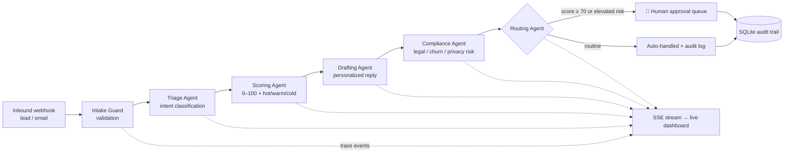

# AI Automation Command Center

A production-style **multi-agent inbound operations platform**. Leads and emails flow in; a LangGraph pipeline of specialized AI agents triages, scores, drafts replies, runs compliance checks, and routes each item — either auto-handling it or queuing it for **human approval**. A live dashboard streams every agent's reasoning in real time over SSE.

**Live demo:** `https://<your-app>.onrender.com` *(deploy steps below)*

## What visitors can do in the demo

1. Submit a lead or email (or click a one-tap sample: 🔥 hot lead, 🌤 warm inquiry, ⚠️ churn risk)
2. Play the customer on the **public contact page** (`/contact`) — a realistic client-website form feeding the same pipeline
3. **Message the Telegram bot** and receive the AI's approved reply back in their own chat (when configured)
4. Watch six agents reason about it **live** in the activity feed
5. Open any item to see the full agent trace timeline, AI summary, drafted reply, and risk notes
6. Act as the human-in-the-loop: **approve or reject** drafted replies — approval triggers a *real* send (Telegram / email)
7. Browse `/integrations` for the webhook contract (n8n · Zapier · Make) and channel setup guides

## Channels

| Channel | Direction | Setup |
|---|---|---|
| Telegram bot | in + out | `TELEGRAM_BOT_TOKEN` from @BotFather (2 min). Polling on localhost, webhook when `BASE_URL` is set |
| Contact widget | in | Built in at `/contact` — zero setup |
| Email (Resend) | out | `RESEND_API_KEY` (free tier). Approved replies are emailed to the sender |
| Slack | alerts | `SLACK_WEBHOOK_URL` — hot leads & high-risk items ping the team |
| n8n / Zapier / Make / any webhook | in | POST to `/api/leads` or `/api/emails`; optional `INTAKE_API_KEY` gate. See `/integrations` |

Every channel is optional and independent — the demo is fully functional with zero keys configured.

## Architecture



### Design decisions

| Decision | Rationale |
|---|---|
| **LangGraph** for orchestration | Explicit, inspectable node/edge workflow — each agent is a pure function over shared state, independently testable |
| **Groq + heuristic fallback** | Public demo must never 500. If the key is missing, rate-limited, or the provider is down, a deterministic keyword-signal engine completes the same pipeline and labels its output `heuristic-fallback` |
| **Human-in-the-loop routing** | High-value (score ≥ 70) or elevated-risk items are never auto-sent — they queue for human approval. Mirrors real enterprise governance |
| **SSE, not WebSockets** | One-directional trace streaming; simpler, proxy-friendly, auto-reconnect built into `EventSource` |
| **SQLite (WAL)** | Single-writer demo workload; the persistence layer is one module — swapping to Postgres is a local change |
| **Trace events as first-class data** | Every agent step is persisted *and* streamed — auditability + the live UX from the same write |

## Tech stack

**Backend:** Python 3.11+, FastAPI, LangGraph, LangChain, Groq (`llama-3.3-70b-versatile`), SQLite, sse-starlette
**Frontend:** Vanilla JS + Tailwind, `EventSource` for live streaming — zero build step
**Tests:** pytest, full API coverage with the fallback engine (no API key needed in CI)

## Run locally

```bash
git clone https://github.com/chinmay6497/ai-automation-command-center.git
cd ai-automation-command-center
python -m venv .venv && source .venv/bin/activate   # Windows: .venv\Scripts\activate
pip install -r requirements.txt
cp .env.example .env                                 # optionally add your GROQ_API_KEY
uvicorn app.main:app --reload
# open http://127.0.0.1:8000
```

Without a `GROQ_API_KEY` the app runs fully in heuristic-fallback mode — every flow still works.

## Tests

```bash
pytest tests/ -v     # 8 tests, no API key required
```

## Deploy to Render (free)

1. Push this folder to a GitHub repo
2. In Render: **New → Blueprint**, point it at the repo — `render.yaml` configures everything
3. Set `GROQ_API_KEY` in the service's Environment tab (free key: console.groq.com)
4. Done. Free tier note: the service sleeps after idle; first request takes ~50 s to wake. The SQLite DB is ephemeral on free tier — demo data re-seeds automatically on each cold start, which is ideal for a public demo.

## API

| Method | Endpoint | Purpose |
|---|---|---|
| POST | `/api/leads` | Submit a lead (202, processes async) |
| POST | `/api/emails` | Submit an inbound email |
| GET | `/api/items` | List processed items |
| GET | `/api/items/{id}` | Item detail incl. full agent trace |
| POST | `/api/items/{id}/approve` | Human approval — "send" the drafted reply |
| POST | `/api/items/{id}/reject` | Reject the draft |
| GET | `/api/stream` | SSE stream of all agent trace events |
| GET | `/api/metrics` | Ops metrics |
| GET | `/api/health` | Health + active engine |
| GET | `/docs` | Interactive OpenAPI docs |

## Roadmap

- Slack/Teams notification node for hot leads
- Pluggable channel adapters (real webhook ingestion from LinkedIn/Twilio/Outlook)
- Eval harness: golden-set scoring of triage/scoring accuracy per prompt version
- Postgres + multi-tenant workspaces

---

Built by **Chinmay Raval** — AI Automation Architect · [GitHub](https://github.com/chinmay6497) · [LinkedIn](https://www.linkedin.com/in/chinmay-raval)
